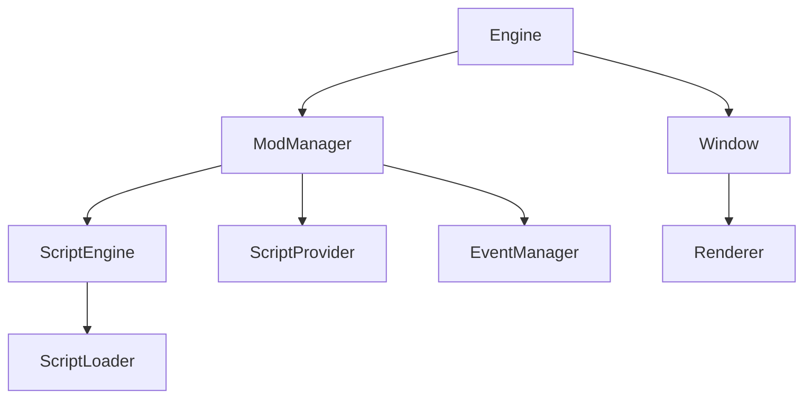

# Engine

Use a custom 2d game engine.

* Full lua modding support: sol2 + luajit.
* SDL3 cross platform media library.
* WIP - networking, rollback system.

```mermaid
graph TD
  Engine --> ModManager
  ModManager --> ScriptEngine
  ScriptEngine --> ScriptLoader
  ModManager --> ScriptProvider
  ModManager --> EventManager
  Engine --> Window
  Window --> Renderer
```
